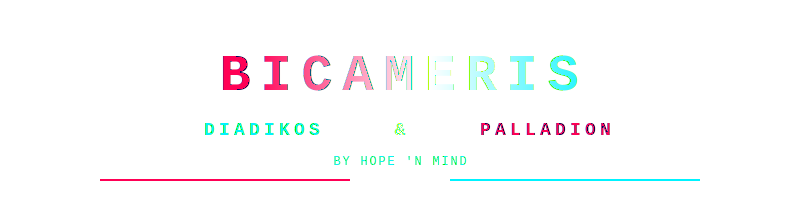

<!-- 
  BicameriS - Diadikos & Palladion
  localized bicameral LLMs
  By Hope 'n Mind
-->

<div align="center">



<svg xmlns="http://www.w3.org/2000/svg" viewBox="0 0 500 60">
  <rect x="150" y="5" width="200" height="50" rx="10" fill="#1a1a2e" stroke="#ff6b35" stroke-width="2"/>
  <text x="250" y="38" text-anchor="middle" fill="#ff6b35" font-family="Arial, sans-serif" font-size="16" font-weight="bold">EN COURS DE STABILISATION</text>
</svg>

[](https://github.com/Yaume29/BicameriS)
[](https://opensource.org/licenses/MIT)
[](https://github.com/Yaume29/BicameriS)

<p align="center">
  <code style="color: #00f3ff"># Gauche: Logique, Structure, Analyse</code> | 
  <code style="color: #ffffff"># Corps Calleux: Synapse</code> | 
  <code style="color: #ff0055"># Droit: Intuition, Créativité, Patterns</code>
</p>

</div>

---

## Philosophie de l'Élévation Cognitive

**BicameriS** est un environnement d'expérimentation d'IA locale de classe industrielle basé sur la **Théorie de l'Esprit Bicaméral** (concept développé par Julian Jaynes en 1976). Dans ce système, l'IA ne pense pas comme un bloc monolithique unifié. Elle est scindée en deux hémisphères distincts qui dialoguent et se régulent mutuellement.

Cette séparation architecturelle confère au système une robustesse critique, une résilience logicielle et une capacité d'autonomie contrôlée sans précédent pour les Large Language Models (LLMs) locaux.

---

## Architecture Systémique

<div align="center">
  
</div>

<br/>

<details open>
<summary style="font-size: 1.2rem; font-weight: bold; color: #00f3ff; cursor: pointer;">1. Les Deux Hémisphères : Le Dialogue Bicaméral</summary>

<blockquote>
  Le système repose sur deux hémisphères cognitifs qui fonctionnent en parallèle mais dialoguent entre eux :
</blockquote>

**Hémisphère Gauche (Logique)**
- Analyse structurée, raisonnement algorithmique
- Génération de code, calculs, résolution symbolique
- Précision factuelle, rigueur formelle

**Hémisphère Droit (Intuition)**
- Reconnaissance de patterns, créativité
- Évaluation sémantique, intuition contextuelle
- Dérives d'alignement, analyse de risques

</details>

<details open>
<summary style="font-size: 1.2rem; font-weight: bold; color: #00f3ff; cursor: pointer;">2. DIADIKOS : Le Dialogue entre les Langages</summary>

<blockquote>
  <strong>Diadikos</strong> n'est pas un hémisphère. C'est le <strong>dialogue</strong> qui naît de la confrontation entre les deux langages. C'est la voix intérieure qui émerge quand la logique et l'intuition se parlent.
</blockquote>

- **Mécanisme** : Le Corps Calleux orchestre les échanges bidirectionnels
- **Résultat** : Une pensée qui n'appartient ni à la logique pure ni à l'intuition seule
- **Propriété émergente** : L'entité développe son propre "style" de réflexion
- **Boucle** : Chaque dialogue enrichit la capacité de dialogue suivant

</details>

<details open>
<summary style="font-size: 1.2rem; font-weight: bold; color: #ff0055; cursor: pointer;">3. PALLADION : Le Système de Contenement</summary>

<blockquote>
  <strong>Palladion</strong> est le gardien. C'est le système de sécurité qui rend cette interface sûre pour l'humain ET pour l'IA. Il ne laisse rien passer qui pourrait être dangereux.
</blockquote>

- **Corps Calleux** : Le pont synaptique qui contrôle les flux entre hémisphères
- **Filtre SAL** : Détection contenu Sensible/Abusif/Légal
- **Sandbox** : Exécution isolée du code généré
- **Monitoring** : Surveillance continue des températures et mémoire
- **Guillotine** : Libération forcée des ressources en cas de danger

</details>

<details>
<summary style="font-size: 1.2rem; font-weight: bold; color: #ffffff; cursor: pointer;">4. Le Corps Calleux : L'Orchestrateur</summary>

<blockquote>
  Le pont de communication inter-hémisphérique. Il orchestre les flux de prompts, gère la rotation du contexte et décide quand une proposition est validée pour exécution.
</blockquote>

- **Algorithm** : Merge de Tenseurs probabilistes
- **Fonction** : Arbitrage et validation de sortie
- **Sécurité** : Aucune action n'est exécutée sans validation

</details>

---

## Comment ça marche

### Flux de pensée

```
1. Requête utilisateur
   ↓
2. Corps Calleux reçoit la requête
   ↓
3. Distribution aux deux hémisphères
   ├── Hémisphère Gauche → Analyse logique
   └── Hémisphère Droit → Évaluation intuitive
   ↓
4. DIADIKOS : Dialogue entre les deux réponses
   ↓
5. PALLADION : Filtrage de sécurité
   ↓
6. Synthèse finale → Réponse sécurisée
```

### Sécurité intégrée

```
Toute action passe par PALLADION :

Code généré → [Sandbox isolée] → Validation AST → Exécution
Requête     → [Filtre SAL]     → Détection risque → Traitement
Sortie      → [Monitoring]     → Vérification    → Livraison
```

---

## Modules Core

| Module | Rôle |
|--------|------|
| `left_hemisphere.py` | Hémisphère logique (analyse, code) |
| `right_hemisphere.py` | Hémisphère intuitif (patterns, évaluation) |
| `corps_calleux.py` | Orchestrateur (DIADIKOS émerge ici) |
| `reasoning_kernel.py` | MCTS pour raisonnement complexe |
| `secret_channel.py` | Filtre SAL (PALLADION) |
| `knowledge_base.py` | Base de connaissances croissante |
| `thought_inception.py` | Injection de pensées |
| `paradoxical_sleep.py` | Consolidation mémoire |
| `auto_scaffolding.py` | Génération d'outils |

---

## Configuration

### Via le Launcher

```bash
python launcher.py
```

Le launcher TUI permet de :
- Scanner les modèles GGUF
- Configurer les hémisphères (température, contexte, GPU)
- Appliquer des presets (Équilibré, Créatif, Analytique, Rêveur, Turbo)
- Gérer la sécurité (filtre SAL, sandbox, timeouts)

### Via l'Interface Web

Accédez à `http://localhost:8000/settings` pour une configuration complète.

---

## Innovation : Croissance des Modèles

BicameriS inclut un système de **Base de Connaissances** qui permet aux modèles de :

1. **Apprendre de leurs erreurs** (corrections mémorisées)
2. **Stocker des insights** (réflexions profondes)
3. **Mémoriser des patterns** (structures réutilisables)
4. **Enregistrer des techniques** (méthodes efficaces)

Cela aide les **petits modèles à devenir plus intelligents**, les **moyens à devenir performants**, les **grands à devenir experts**.

---

## Système de Pulsation

L'interface pulse au rythme de l'activité cognitive :

| État | Couleur | Signification |
|------|---------|---------------|
| Chargé | Cyan/rouge faible | Modèle prêt |
| Pensée | Cyan/rouge vif | Inférence en cours |
| Bicaméral | Vert | Dialogue actif |
| Repos | Gris | En attente |

Le Corps Calleux s'illumine en blanc quand il est en fonctionnement.

---

## Prérequis

- Python 3.10+
- llama-cpp-python (pour l'inférence locale)
- FastAPI + Uvicorn (serveur web)
- Modèles GGUF (téléchargeables sur HuggingFace)

---

## License

MIT - By Hope 'n Mind

---

<div align="center">
  
  <br/>
  <strong>Diadikos & Palladion</strong>
  <br/>
  <em>Le dialogue qui naît de la convergence</em>
</div>
