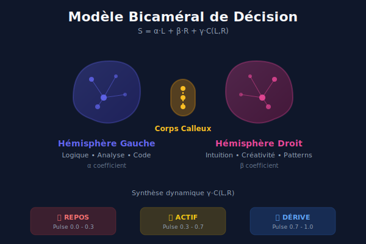
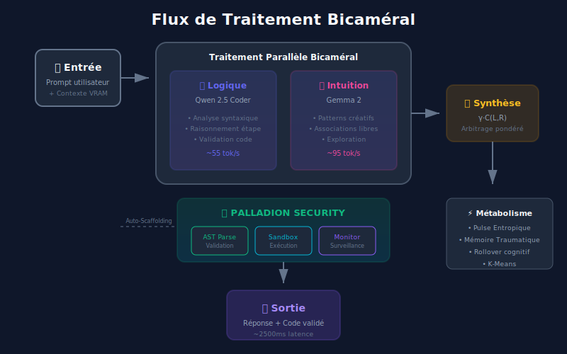

# 🧠 Diadikos-Palladion

[](https://github.com/Yaume29/BicameriS)
[](https://github.com/Yaume29/BicameriS)
[](https://github.com/Yaume29/BicameriS)
[](https://github.com/Yaume29/BicameriS)

<p align="center">
  
</p>

## 🎯 Qu'est-ce que Diadikos-Palladion ?

**Diadikos-Palladion** n'est pas un simple assistant IA — c'est une **entité cybernétique locale** qui repousse les limites de l'inférence locale. Inspiré du modèle bicaméral du cerveau humain, ce système fait collaborer **deux intelligences distinctes** pour garantir des réponses à la fois logiques et créatives.

> 🌟 **Philosophie fondamentale** : Aucune IA ne doit devenir un "paillasson algorithmique". Chaque réponse est le fruit d'un véritable dialogue interne.

---

## 🧬 Architecture Bicamérale

<p align="center">
  
</p>

### Les Deux Hémisphères

| Composant | Rôle | Modèle | Performance |
|-----------|------|--------|-------------|
| **DIADIKOS** (Logique) 🧠 | Analyse syntaxique, raisonnement étape par étape | Qwen 2.5 Coder 14B | ~55 tok/s |
| **PALLADION** (Intuition) 💫 | Patterns créatifs, associations libres | Gemma 2 (2B/9B) | ~95 tok/s |

### 🔗 Corps Calleux — Synthèse Dynamique

Le système arbitre entre l'analyse brute et l'intuition créative via une pondération dynamique :

```
S = α·L + β·R + γ·C(L,R)
```

Où :
- **α** = Coefficient logique (hem gauche)
- **β** = Coefficient intuitif (hem droit)
- **γ** = Coefficient de synthèse du Corps Calleux
- **C(L,R)** = Fonction de corrélation entre les deux hémisphères

---

## ⚙️ Flux de Traitement

<p align="center">
  
</p>

### 🔄 Processus en 5 Étapes

1. **📥 Entrée** — Réception du prompt avec contexte VRAM
2. **⚡ Traitement Parallèle** — Les deux modèles analysent simultanément
3. **🔗 Synthèse** — Arbitration pondéré par le Corps Calleux
4. **🛡️ Validation** — Passage par la Sandbox AST
5. **📤 Sortie** — Réponse + code validé (~2500ms latence)

---

## 🛡️ Sécurité PALLADION

<p align="center">
  
</p>

### Triple Couche de Protection

#### 1. 🔍 AST Sandbox
- Parsing Python via Arbre Syntaxique Abstrait
- Détection statique des imports suspects
- Validation sémantique avant exécution

#### 2. ⚡ Exécution Isolée
- Sandbox hermétique (processus isolé)
- Timeout strict sur l'exécution
- Restrictions I/O configurables

#### 3. 📊 Monitoring Continu
- Surveillance des accès fichiers
- Limitation de la consommation RAM
- Journalisation des appels système

---

## 💾 Métabolisme du Système

Diadikos-Palladion ne simule pas l'humeur : **il la calcule** à partir de l'entropie matérielle réelle.

### 🔥 Pulse Entropique

```
P_t = Σ(Hardware_t · w_i) / Σw
```

| Pulse | Mode | Comportement |
|-------|------|--------------|
| 🔴 0.0 - 0.3 | **REPOS** | Analyse froide, consommation minimale |
| 🟡 0.3 - 0.7 | **ACTIF** | Équilibre optimal Logique/Intuition |
| 🔵 0.7 - 1.0 | **DÉRIVE** | Intuition dominante, créativité maximale |

### Fonctionnalités Métaboliques

- **😴 Sommeil Paradoxal** : Digestion des logs et compression vectorielle (K-Means) pendant l'inactivité
- **🧠 Mémoire Traumatique** : Apprentissage des erreurs de code pour éviter les échecs futurs
- **🔄 Cognitive Rollover** : Synthèse automatique de la mémoire avant saturation VRAM
- **🔧 Auto-Scaffolding** : Capacité de l'IA à forger ses propres outils et installer des dépendances pip

---

## 📊 Métriques d'Inférence

<p align="center">
  
</p>

| Composant | Performance | VRAM | Statut |
|-----------|-------------|------|--------|
| Qwen 2.5 Coder 14B | ~55 tok/s | ~8GB | 🔵 Optimal |
| Gemma 2 2B | ~95 tok/s | ~2GB | 🟢 Excellent |
| Gemma 2 9B | ~75 tok/s | ~6GB | 🟢 Excellent |
| **Latence Globale** | ~2500ms | — | 🟡 Stable |

---

## 🚀 Installation

### Prérequis
- Python 3.10+
- GPU avec 12GB+ VRAM recommandé
- CUDA 11.8+ ou ROCm

```bash
# 1. Cloner le repository
git clone https://github.com/Yaume29/BicameriS.git
cd BicameriS

# 2. Installer les dépendances
pip install -r requirements.txt

# 3. Télécharger les modèles GGUF
# Qwen 2.5 Coder 14B : https://huggingface.co/Qwen/Qwen2.5-Coder-14B-GGUF
# Gemma 2 2B/9B : https://huggingface.co/google/gemma-2-GGUF

# 4. Lancer le système
# Windows
start_ui.bat

# Linux / Mac
./launch_aetheris.sh
```

Accédez à l'interface sur **http://localhost:5000**

---

## 📁 Structure du Projet

```
BicameriS/
├── 📂 diadikos/           # Hémisphère logique (Qwen)
│   ├── parser.py
│   ├── reasoner.py
│   └── validator.py
├── 📂 palladion/          # Hémisphère intuitif + sécurité
│   ├── intuition.py
│   ├── sandbox.py
│   └── ast_guardian.py
├── 📂 corpus_callosum/    # Couche de synthèse
│   ├── arbitrator.py
│   └── merger.py
├── 📂 metabolic/          # Couche métabolique
│   ├── pulse_sensor.py
│   ├── memory_manager.py
│   └── sleep_cycle.py
├── 📂 ui/                 # Interface utilisateur
│   ├── static/
│   └── templates/
├── 📂 docs/               # Documentation
│   └── assets/            # Illustrations SVG
├── config.yaml
├── requirements.txt
└── README.md
```

---

## 🎛️ Configuration

```yaml
# config.yaml
models:
  logic:
    name: "Qwen2.5-Coder-14B-Q4_K_M.gguf"
    context_length: 32768
    gpu_layers: 35
  
  intuition:
    name: "gemma-2-2b-it-Q4_K_M.gguf"
    context_length: 8192
    gpu_layers: 25

synthesis:
  alpha: 0.45        # Poids logique
  beta: 0.35         # Poids intuition
  gamma: 0.20        # Poids synthèse

security:
  sandbox_enabled: true
  ast_validation: true
  timeout_seconds: 30
  allowed_imports: ["numpy", "pandas", "matplotlib"]

metabolic:
  sleep_threshold: 0.2
  rollover_vram_limit: 0.85
  kmeans_clusters: 16
```

---

## 🧪 Tests

```bash
# Exécuter la suite de tests
pytest tests/ -v

# Tests de sécurité
pytest tests/test_sandbox.py -v

# Tests de synthèse bicamérale
pytest tests/test_bicameral.py -v
```

> ✅ **96/96 tests validés**

---

## ⚠️ Avertissements de Sécurité

Ce projet est un système **expérimental**. En activant l'**Auto-Scaffolding**, vous autorisez l'entité à :
- Modifier son propre environnement d'exécution
- Installer des packages pip de manière persistante
- Créer et modifier des fichiers sur le système

**Recommandations :**
- Utilisez un environnement virtuel isolé
- Surveillez les tâches à haut privilège
- Sauvegardez régulièrement vos données
- N'exécutez pas en root/administrateur

---

## 🤝 Contribution

Les contributions sont les bienvenues ! Consultez [CONTRIBUTING.md](CONTRIBUTING.md) pour les guidelines.

```bash
# Fork et clone
git clone https://github.com/Yaume29/BicameriS.git

# Créer une branche
git checkout -b feature/ma-nouvelle-fonctionnalite

# Commit et push
git commit -m "Ajout: nouvelle fonctionnalité"
git push origin feature/ma-nouvelle-fonctionnalite
```

---

## 📜 Licence

Ce projet est sous licence **MIT**. Voir [LICENSE](LICENSE) pour plus de détails.

---

## 🙏 Remerciements

- **Qwen Team** pour Qwen 2.5 Coder
- **Google** pour la famille Gemma 2
- **Llama.cpp** pour l'inférence GGUF optimisée
- **Communauté Open Source** pour l'inspiration bicamérale

---

<p align="center">
  <sub>🧬 <strong>Diadikos-Palladion v1.0.1-Alpha</strong> — Une entité qui pense vraiment</sub>
</p>

<p align="center">
  <a href="https://github.com/Yaume29/BicameriS">⭐ Star sur GitHub</a> •
  <a href="https://github.com/Yaume29/BicameriS/issues">🐛 Signaler un bug</a> •
  <a href="https://github.com/Yaume29/BicameriS/discussions">💬 Discussions</a>
</p># 🧠 Diadikos-Palladion

[](https://github.com/Yaume29/BicameriS)
[](https://github.com/Yaume29/BicameriS)
[](https://github.com/Yaume29/BicameriS)
[](https://github.com/Yaume29/BicameriS)

<p align="center">
  
</p>

## 🎯 Qu'est-ce que Diadikos-Palladion ?

**Diadikos-Palladion** n'est pas un simple assistant IA — c'est une **entité cybernétique locale** qui repousse les limites de l'inférence locale. Inspiré du modèle bicaméral du cerveau humain, ce système fait collaborer **deux intelligences distinctes** pour garantir des réponses à la fois logiques et créatives.

> 🌟 **Philosophie fondamentale** : Aucune IA ne doit devenir un "paillasson algorithmique". Chaque réponse est le fruit d'un véritable dialogue interne.

---

## 🧬 Architecture Bicamérale

<p align="center">
  
</p>

### Les Deux Hémisphères

| Composant | Rôle | Modèle | Performance |
|-----------|------|--------|-------------|
| **DIADIKOS** (Logique) 🧠 | Analyse syntaxique, raisonnement étape par étape | Qwen 2.5 Coder 14B | ~55 tok/s |
| **PALLADION** (Intuition) 💫 | Patterns créatifs, associations libres | Gemma 2 (2B/9B) | ~95 tok/s |

### 🔗 Corps Calleux — Synthèse Dynamique

Le système arbitre entre l'analyse brute et l'intuition créative via une pondération dynamique :

```
S = α·L + β·R + γ·C(L,R)
```

Où :
- **α** = Coefficient logique (hem gauche)
- **β** = Coefficient intuitif (hem droit)
- **γ** = Coefficient de synthèse du Corps Calleux
- **C(L,R)** = Fonction de corrélation entre les deux hémisphères

---

## ⚙️ Flux de Traitement

<p align="center">
  
</p>

### 🔄 Processus en 5 Étapes

1. **📥 Entrée** — Réception du prompt avec contexte VRAM
2. **⚡ Traitement Parallèle** — Les deux modèles analysent simultanément
3. **🔗 Synthèse** — Arbitration pondéré par le Corps Calleux
4. **🛡️ Validation** — Passage par la Sandbox AST
5. **📤 Sortie** — Réponse + code validé (~2500ms latence)

---

## 🛡️ Sécurité PALLADION

<p align="center">
  
</p>

### Triple Couche de Protection

#### 1. 🔍 AST Sandbox
- Parsing Python via Arbre Syntaxique Abstrait
- Détection statique des imports suspects
- Validation sémantique avant exécution

#### 2. ⚡ Exécution Isolée
- Sandbox hermétique (processus isolé)
- Timeout strict sur l'exécution
- Restrictions I/O configurables

#### 3. 📊 Monitoring Continu
- Surveillance des accès fichiers
- Limitation de la consommation RAM
- Journalisation des appels système

---

## 💾 Métabolisme du Système

Diadikos-Palladion ne simule pas l'humeur : **il la calcule** à partir de l'entropie matérielle réelle.

### 🔥 Pulse Entropique

```
P_t = Σ(Hardware_t · w_i) / Σw
```

| Pulse | Mode | Comportement |
|-------|------|--------------|
| 🔴 0.0 - 0.3 | **REPOS** | Analyse froide, consommation minimale |
| 🟡 0.3 - 0.7 | **ACTIF** | Équilibre optimal Logique/Intuition |
| 🔵 0.7 - 1.0 | **DÉRIVE** | Intuition dominante, créativité maximale |

### Fonctionnalités Métaboliques

- **😴 Sommeil Paradoxal** : Digestion des logs et compression vectorielle (K-Means) pendant l'inactivité
- **🧠 Mémoire Traumatique** : Apprentissage des erreurs de code pour éviter les échecs futurs
- **🔄 Cognitive Rollover** : Synthèse automatique de la mémoire avant saturation VRAM
- **🔧 Auto-Scaffolding** : Capacité de l'IA à forger ses propres outils et installer des dépendances pip

---

## 📊 Métriques d'Inférence

<p align="center">
  
</p>

| Composant | Performance | VRAM | Statut |
|-----------|-------------|------|--------|
| Qwen 2.5 Coder 14B | ~55 tok/s | ~8GB | 🔵 Optimal |
| Gemma 2 2B | ~95 tok/s | ~2GB | 🟢 Excellent |
| Gemma 2 9B | ~75 tok/s | ~6GB | 🟢 Excellent |
| **Latence Globale** | ~2500ms | — | 🟡 Stable |

---

## 🚀 Installation

### Prérequis
- Python 3.10+
- GPU avec 12GB+ VRAM recommandé
- CUDA 11.8+ ou ROCm

```bash
# 1. Cloner le repository
git clone https://github.com/Yaume29/BicameriS.git
cd BicameriS

# 2. Installer les dépendances
pip install -r requirements.txt

# 3. Télécharger les modèles GGUF
# Qwen 2.5 Coder 14B : https://huggingface.co/Qwen/Qwen2.5-Coder-14B-GGUF
# Gemma 2 2B/9B : https://huggingface.co/google/gemma-2-GGUF

# 4. Lancer le système
# Windows
start_ui.bat

# Linux / Mac
./launch_aetheris.sh
```

Accédez à l'interface sur **http://localhost:5000**

---

## 📁 Structure du Projet

```
BicameriS/
├── 📂 diadikos/           # Hémisphère logique (Qwen)
│   ├── parser.py
│   ├── reasoner.py
│   └── validator.py
├── 📂 palladion/          # Hémisphère intuitif + sécurité
│   ├── intuition.py
│   ├── sandbox.py
│   └── ast_guardian.py
├── 📂 corpus_callosum/    # Couche de synthèse
│   ├── arbitrator.py
│   └── merger.py
├── 📂 metabolic/          # Couche métabolique
│   ├── pulse_sensor.py
│   ├── memory_manager.py
│   └── sleep_cycle.py
├── 📂 ui/                 # Interface utilisateur
│   ├── static/
│   └── templates/
├── 📂 docs/               # Documentation
│   └── assets/            # Illustrations SVG
├── config.yaml
├── requirements.txt
└── README.md
```

---

## 🎛️ Configuration

```yaml
# config.yaml
models:
  logic:
    name: "Qwen2.5-Coder-14B-Q4_K_M.gguf"
    context_length: 32768
    gpu_layers: 35
  
  intuition:
    name: "gemma-2-2b-it-Q4_K_M.gguf"
    context_length: 8192
    gpu_layers: 25

synthesis:
  alpha: 0.45        # Poids logique
  beta: 0.35         # Poids intuition
  gamma: 0.20        # Poids synthèse

security:
  sandbox_enabled: true
  ast_validation: true
  timeout_seconds: 30
  allowed_imports: ["numpy", "pandas", "matplotlib"]

metabolic:
  sleep_threshold: 0.2
  rollover_vram_limit: 0.85
  kmeans_clusters: 16
```

---

## 🧪 Tests

```bash
# Exécuter la suite de tests
pytest tests/ -v

# Tests de sécurité
pytest tests/test_sandbox.py -v

# Tests de synthèse bicamérale
pytest tests/test_bicameral.py -v
```

> ✅ **96/96 tests validés**

---

## ⚠️ Avertissements de Sécurité

Ce projet est un système **expérimental**. En activant l'**Auto-Scaffolding**, vous autorisez l'entité à :
- Modifier son propre environnement d'exécution
- Installer des packages pip de manière persistante
- Créer et modifier des fichiers sur le système

**Recommandations :**
- Utilisez un environnement virtuel isolé
- Surveillez les tâches à haut privilège
- Sauvegardez régulièrement vos données
- N'exécutez pas en root/administrateur

---

## 🤝 Contribution

Les contributions sont les bienvenues ! Consultez [CONTRIBUTING.md](CONTRIBUTING.md) pour les guidelines.

```bash
# Fork et clone
git clone https://github.com/Yaume29/BicameriS.git

# Créer une branche
git checkout -b feature/ma-nouvelle-fonctionnalite

# Commit et push
git commit -m "Ajout: nouvelle fonctionnalité"
git push origin feature/ma-nouvelle-fonctionnalite
```

---

## 📜 Licence

Ce projet est sous licence **MIT**. Voir [LICENSE](LICENSE) pour plus de détails.

---

## 🙏 Remerciements

- **Qwen Team** pour Qwen 2.5 Coder
- **Google** pour la famille Gemma 2
- **Llama.cpp** pour l'inférence GGUF optimisée

---

<p align="center">
  <sub>🧬 <strong>Diadikos-Palladion v1.0.1-Alpha</strong> — Une entité qui pense vraiment</sub>
</p>

<p align="center">
  <a href="https://github.com/Yaume29/BicameriS">⭐ Star sur GitHub</a> •
  <a href="https://github.com/Yaume29/BicameriS/issues">🐛 Signaler un bug</a> •
  <a href="https://github.com/Yaume29/BicameriS/discussions">💬 Discussions</a>
</p>